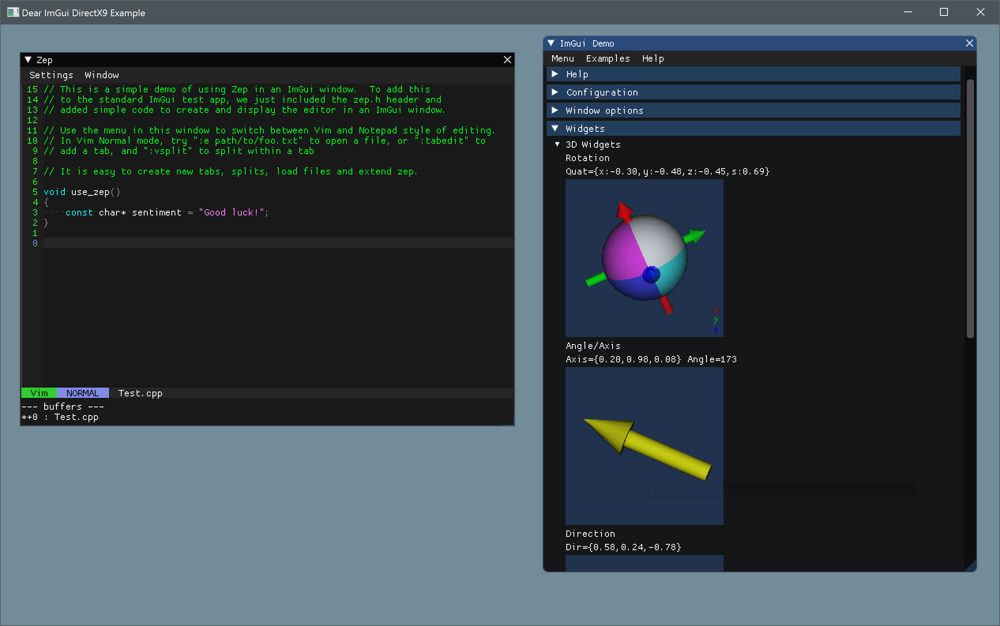

Zep ImGui Demo
==============

This is an example of integrating Zep into the standard ImGui demo.  There are only a few changes to imgui_demo to make this happen!
Also in this screenshot you can see a 3D Widget that I ported to ImGui a few years back...

The main Zep repo is at [Zep](https://github.com/cmaughan/zep).

You can go to [ImGui](https://github.com/ocornut/imgui) to see the main ImGui Repository
